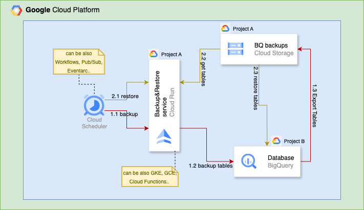

# BigQuery Backup&Restore Automation
> An open-source, scalable, and multi-threaded solution that supports many formats for automating backups and restores of BigQuery datasets and tables.

[](https://github.com/sahmadov/bigquery-backup-restore-service/actions/workflows/ci-cd.yml)
[](https://opensource.org/licenses/Apache-2.0)
[](https://github.com/sahmadov/bigquery-backup-restore-service)
[](https://github.com/sahmadov/bigquery-backup-restore-service/pkgs/container/bigquery-backup-restore-service)

I built this open-source solution to automate BigQuery backups and restores. It handles multiple formats, supports threading for better performance, and scales well. You can backup entire datasets or specific tables, export to common formats like Avro, CSV, Parquet, or JSON, and restore data exactly when you need it.

## Architecture Overview



### How It Works

The components of the architecture I now utilize in order to build are end image is:

1. On a predetermined schedule, **Cloud Scheduler** initiates backup and restoration operations. Other triggering methods that you could have used are: Eventarc, Pub/Sub with push subscription, Workflows and many others. You might also prefer to start only once in a while from your localhost.

2. The entire procedure is coordinated by **Backup/Restore Service** (Cloud Run, in my case):
   - **Flow of Backup operation(1.x):**
      - 1.1: Cloud Scheduler starts the backup procedure
      - 1.2: Service prepares export of tables. Fun Fact, in Bigquery libs (as of today) there is no built-in support for exporting whole dataset only table is possibly (most probably, because there is no snapshot of dataset concept yet)  
      - 1.3: Cloud Storage is where our target tables are being exported.

   - **Flow of restore operation (2.x):**
      - 2.1: Cloud Scheduler starts the restore procedure
      - 2.2: Our Service obtains table/dataset data from Cloud Storage
      - 2.3: Finally, Tables of target dataset are restored back to BigQuery. (it doesn't overwrite existing dataset instead creates new one with __restored_ prefix)


Depending on your needs, this containerized service can also be set up on different compute platforms like as Cloud Functions, GKE, or GCE. As a result, your architecture may change from the one above. Ultimately, all you need to operate on GCP is a Docker image - your architecture choice is optional.

## **Why This Project Exists**

Organizations that use BigQuery will often find themselves in a position where fundamental reliability features—multi-region deployments, cross-region replication, time travel, and auto-failover—are not enough. Certain regulatory requirements or organizational policies requires that backups must be stored completely outside of the Google Cloud ecosystem, such as on-prem or AWS or even Azure. That's exactly the issue this service attempts to address.

### A Practical Solution

This project, which was initially created to satisfy tough regulatory requirements, allows you to: 
* **Extract** data from BigQuery 
* **Store** it in a portable format appropriate for on-premises systems or other cloud providers 
* **Restore** it when necessary.

After developing an in-house solution, I found that a number of other teams had developed the very same backups for their own compliance or data governance needs independently. To get everyone from not having to reinvent the wheel, I open-sourced it.

### Important Use Cases Beyond Compliance

* **Cross-Environment Data Refresh**: Add production data to development/testing environments 
* **Project Migration**: Move datasets between GCP projects or organizations 
* **Long-Term Archival**: Keep inexpensive backups after BigQuery's time travel window has passed.

## How to Use
Two sources can be used to obtain the application image, which is a typical Docker image:

1. My publicly available Google Artifact Registry: europe-west3-docker.pkg.dev/bigquery-automation-454819/bigquery-service-repo/bigquery-backup-restore-service
2. or again publicly available GitHub's Docker registry: ghcr.io/sahmadov/bigquery-backup-restore-service

To use the image, you must push it to your personal Google Artifact Registry after pulling it. But if you'd rather have a detailed guide, here's how to do it:

### Prerequisites

Before starting, ensure you have:
1. Created your own Artifact Registry for pushing images. This is because you might anyway need to have image in your own gcp project.
2. Create a Cloud Storage bucket for saving backups. This will be later used in your json http requests to tell our service where to save backups.

#### Step 1: Google Cloud Authentication

```bash
# Login to your Google Cloud account
gcloud auth login

# Set your active project
gcloud config set project YOUR_PROJECT_ID

# Configure Docker to use Google Cloud credentials
gcloud auth configure-docker YOUR_GCP_REGION-docker.pkg.dev
```

#### Step 2: Pull and Push the Image

Choose one of the below based on the registry you would like to pull from:

**Option A: Pull from Google Artifact Registry**
```bash
# Pull the image from our GCP Artifact Registry
docker pull europe-west3-docker.pkg.dev/bigquery-automation-454819/bigquery-service-repo/bigquery-backup-restore-service:latest

# Tag the image for your own registry
docker tag europe-west3-docker.pkg.dev/bigquery-automation-454819/bigquery-service-repo/bigquery-backup-restore-service:latest \
    europe-west3-docker.pkg.dev/YOUR_PROJECT_ID/YOUR_REPOSITORY/bigquery-backup-restore-service:latest

# Push to your registry
docker push europe-west3-docker.pkg.dev/YOUR_PROJECT_ID/YOUR_REPOSITORY/bigquery-backup-restore-service:latest
```

**Option B: Pull from GitHub Packages**
```bash
# Create a GitHub Personal Access Token with read:packages scope
# Then login to GitHub Container Registry
echo $GITHUB_TOKEN | docker login ghcr.io -u YOUR_GITHUB_USERNAME --password-stdin

# Pull the image from GitHub Packages
docker pull ghcr.io/sahmadov/bigquery-backup-restore-service:latest

# Tag the image for your own registry
docker tag ghcr.io/sahmadov/bigquery-backup-restore-service:latest \
    europe-west3-docker.pkg.dev/YOUR_PROJECT_ID/YOUR_REPOSITORY/bigquery-backup-restore-service:latest

# Push to your registry
docker push europe-west3-docker.pkg.dev/YOUR_PROJECT_ID/YOUR_REPOSITORY/bigquery-backup-restore-service:latest
```

#### Step 3: Deploy to Cloud Run
You can take the following actions to test it as shown in the architectural diagram above:
1. Go to the Cloud Run service in your GCP Console
2. Click "Deploy container" and choose Service option.
3. In Container image URL, select the container image you pushed to your Artifact Registry in step2
4. Configure the cloud run service based on your preferences. Make sure the service account you use, must have the following permissions (you might need to go to service accounts in order to create one): 
   - BigQuery Data Editor 
   - BigQuery User 
   - Storage Admin roles

#### Step 4: Test the Service
All we have to do now is send our request json files to our endpoints (/api/v1/backup and /api/v1/restore) under the URL where our cloud run has been launched. Although you may essentially use any tool here, I have prepared an action.sh script to make things easier for you right away. To use it, simply clone this repository and navigate to scripts/action.sh.

Although there are a lot more choices in request JSON files, I only use the minimal valid requests for simplicity's sake.
1. Update the request files with your specific values:
   ```bash
   # Edit backup request file with:
   # - bigQuery.projectId GCP project which is hosting bigquery database
   # - backupStorage.gcsOptions.uri which specifies where to save backups.
   nano scripts/examples/backup_request_minimal.json
   ```

2. Update the Cloud Run URL in the action script:
   ```bash
   # Edit the CLOUD_RUN_BASE_URL value to point to your deployed service
   nano scripts/action.sh
   ```

3. Run your first backup:
   ```bash
   ./scripts/action.sh backup ./scripts/examples/backup_request_minimal.json DEBUG
   ```

4. Run a restore operation:
   ```bash
   # Edit restore request with:
   # bigQuery.projectId - gcp project where you have your target bigquery running
   # bigQuery.datasetsToRestore - name of datasets that you want to restore
   # restoreStorage.gcsOptions.uri - cloud bucket where you saved your backups in previous backup step.
   # restoreStorage.gcsOptions.backupTimestamp - the date when backup is taken, please refer to gcs bucket in ordert to find exact date and format.
   # restoreStorage.gcsOptions.projectIdOfBackup - if Bigquery on which we took backup is different than were we want to restore, then this should be the original bigquery gcp project if not then this is usually same with bigQuery.projectId. Specifically helpful if you use this service in order move data between environments.
   nano scripts/examples/restore_request_minimal.json.json
   
   # Run the restore
   ./scripts/action.sh restore ./scripts/examples/restore_request_minimal.json DEBUG
   ```
   
## Contributing

We welcome your contributions! Please take a look at our [contribution guidelines](CONTRIBUTING.md) first.

## License

This project is licensed under the Apache License 2.0 - see the [LICENSE](LICENSE) file for details.